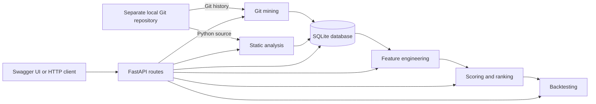

# Code Smell Detector and Technical Debt Analyzer

A FastAPI service for mining a Python repository's Git history, detecting selected code smells, calculating file-level features, and ranking files by technical-debt signals. The service stores its data in SQLite by default.

## Architecture



## Project Layout

- `backend/app/main.py` creates the FastAPI application, initializes database tables, and registers the API routers.
- `backend/app/api/routes/` contains health, ingestion, feature, score, backtest, and file endpoints.
- `backend/app/services/` implements Git mining, static analysis, feature engineering, scoring, ranking, and backtesting.
- `backend/app/db/` defines the SQLAlchemy engine, models, and table initialization.
- `backend/app/schemas/` contains API data schemas.
- `requirements.txt` lists Python dependencies.
- `.env.example` provides the SQLite database configuration.

## Setup

Requires Python 3.10 or newer and Git. Run commands from the project root.

### Windows PowerShell

The checked-in `requirements.txt` is UTF-16 encoded. Convert it to a temporary UTF-8 requirements file before installing:

```powershell
python -m venv .venv
.venv\Scripts\Activate.ps1
Get-Content -Path requirements.txt -Encoding Unicode | Set-Content -Path requirements.utf8.txt -Encoding utf8
python -m pip install -r requirements.utf8.txt
Remove-Item requirements.utf8.txt
Copy-Item .env.example .env
python -m uvicorn app.main:app --app-dir backend --reload --port 8000
```

### macOS / Linux

```bash
python3 -m venv .venv
source .venv/bin/activate
iconv -f UTF-16 -t UTF-8 requirements.txt > requirements.utf8.txt
python -m pip install -r requirements.utf8.txt
rm requirements.utf8.txt
cp .env.example .env
python -m uvicorn app.main:app --app-dir backend --reload --port 8000
```

The API is available at `http://127.0.0.1:8000`. Interactive endpoint documentation is at `http://127.0.0.1:8000/docs`; the OpenAPI schema is at `http://127.0.0.1:8000/openapi.json`. The database file is created at the location configured by `DATABASE_URL` in `.env` (the example uses `./app.db`, relative to the project root).

## Endpoint Testing

For ingestion tests, provide a path to a **separate local codebase that is a Git repository**. It must have a `.git` directory and should contain Python files for static analysis. Do not use a plain source folder without Git history. For example, clone a repository into a sibling directory:

```powershell
git clone https://github.com/psf/requests.git ..\requests-test
```

Open Swagger UI at `http://127.0.0.1:8000/docs`, select an endpoint, and use the full local path to that clone. On Windows, JSON paths need escaped backslashes. Run Git ingestion first so file and commit records exist, then run static analysis:

```json
{
  "repo_path": "D:\\Tech\\Development\\Projects\\requests-test"
}
```

### Available Endpoints

| Method | Path | Purpose |
| --- | --- | --- |
| `GET` | `/health` | Check that the API is running. |
| `POST` | `/ingest/git` | Mine commits and changed files from the supplied Git repository. |
| `POST` | `/ingest/analysis` | Analyze Python source files in the supplied repository for supported smells. |
| `GET` | `/features ` | Return computed per-file features. The registered path currently includes a trailing space; check `/docs` or `/openapi.json` for the exact request URL. |
| `POST` | `/scores/compute` | Compute and persist file scores. |
| `POST` | `/backtest/run` | Run a backtest using a cutoff datetime and top-percent value. |
| `GET` | `/files/ranked` | Retrieve ranked file scores. |
| `GET` | `/files/{file_id}/breakdown` | Retrieve the score and smell details for a file. |

Example request bodies:

```json
{"repo_path": "D:\\Tech\\Development\\Projects\\requests-test"}
```

Use this body for either ingestion endpoint. To run a backtest:

```json
{"cutoff": "2024-01-01T00:00:00Z", "top_percent": 0.1}
```

## Analysis Signals

The analyzer currently flags high cyclomatic complexity and low maintainability index. Feature computation uses file churn, the ratio of bug-fix commits, and smell counts. Scores and rankings are exposed through the API; tune the scoring logic in `backend/app/services/scoring.py` as the project evolves.

## Configuration

Set `DATABASE_URL` in `.env` to select a database. The supplied `.env.example` configures SQLite. Keep `.env` local and do not commit credentials or machine-specific settings.
