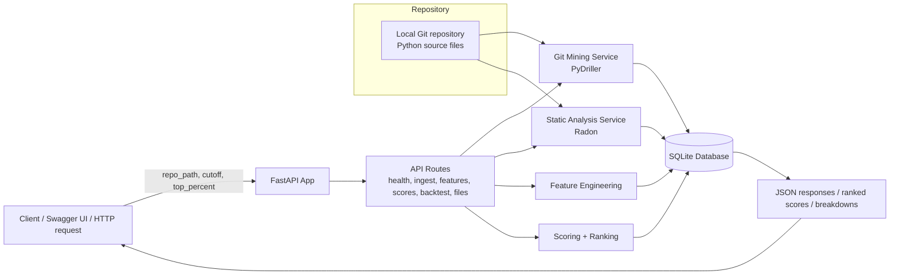

# Code Smell Detector and Technical Debt Analyzer

A lightweight FastAPI service for mining the Git history of a Python repository, analyzing source code for technical-debt smells, computing file-level features, and scoring files to identify likely hotspots for maintenance work.

This project is designed for local analysis workflows: a user provides a Git repository path, the app mines metadata and changes from that repo, analyzes Python files, stores the results in SQLite, and exposes scored file rankings through an API.

## Tech stack

- Python 3.10+
- FastAPI for the HTTP API
- SQLAlchemy ORM for database access
- SQLite as the default database backend
- Pydantic + Pydantic Settings for request and configuration validation
- PyDriller for Git history mining
- Radon for complexity and maintainability analysis
- Git for repository ingestion
- Uvicorn for running the API server

## Architecture



## Current project layout

- `backend/app/main.py` creates the FastAPI app and registers routers.
- `backend/app/api/routes/` contains the API endpoints for health, ingestion, features, scoring, backtesting, and ranked files.
- `backend/app/services/` contains the git mining, static analysis, feature engineering, scoring, ranking, and backtesting logic.
- `backend/app/db/` contains SQLAlchemy models, database setup, and table initialization.
- `backend/app/config.py` loads environment settings, including the database URL.
- `backend/tests/` contains regression tests for feature and scoring correctness.
- `.env.example` provides the default SQLite configuration.

## User data flow

1. The client sends a request to the FastAPI app.
2. For repository ingestion, the request includes a `repo_path` value pointing to a local Git repository.
3. The ingestion route calls the Git mining service, which traverses commits and changed files through PyDriller.
4. The app stores commit metadata, file metadata, and file change rows in SQLite.
5. For static analysis, the app scans repository Python files, runs Radon checks, and stores smell records.
6. Feature engineering reads the stored commit, file, and smell data and computes churn, bugfix ratio, and smell density per file.
7. The scoring service normalizes those feature values and produces a total file score.
8. The API returns the computed results for ranking, file breakdowns, or backtest evaluation.

This is the working pipeline of the current codebase.

## Setup

Requires Python 3.10+ and Git.

### 1) Create and activate a virtual environment

```powershell
python -m venv .venv
.\.venv\Scripts\Activate.ps1
```

### 2) Install dependencies

The checked-in `requirements.txt` is stored in UTF-16 encoding. Convert it to UTF-8 before installing dependencies.

```powershell
Get-Content -Path requirements.txt -Encoding Unicode | Set-Content -Path requirements.utf8.txt -Encoding utf8
python -m pip install -r requirements.utf8.txt
Remove-Item requirements.utf8.txt
```

### 3) Configure environment

```powershell
Copy-Item .env.example .env
```

The default configuration is:

```env
DATABASE_URL=sqlite:///./app.db
```

### 4) Run the API

```powershell
python -m uvicorn app.main:app --app-dir backend --reload --port 8000
```

The API is available at:

- http://127.0.0.1:8000
- Swagger UI: http://127.0.0.1:8000/docs
- OpenAPI schema: http://127.0.0.1:8000/openapi.json

## API endpoints

| Method | Path | Purpose |
| --- | --- | --- |
| `GET` | `/health` | Check whether the API is running. |
| `POST` | `/ingest/git` | Mine Git history and file changes for a repository. |
| `POST` | `/ingest/analysis` | Analyze Python source files for supported code smells. |
| `GET` | `/features` | Return computed per-file features. |
| `POST` | `/scores/compute` | Compute and persist file scores. |
| `POST` | `/backtest/run` | Run a cutoff-based backtest against bugfix files. |
| `GET` | `/files/ranked` | Return the latest ranked file scores. |
| `GET` | `/files/{file_id}/breakdown` | Return score details and smell details for a file. |

## Example requests

### Ingest repository history

```json
{
  "repo_path": "D:\\Tech\\Development\\Projects\\requests-test"
}
```

### Analyze repository source files

```json
{
  "repo_path": "D:\\Tech\\Development\\Projects\\requests-test"
}
```

### Run a backtest

```json
{
  "cutoff": "2024-01-01T00:00:00Z",
  "top_percent": 0.1
}
```

## Current analysis signals

The analyzer currently captures:

- high cyclomatic complexity
- low maintainability index
- file churn
- bugfix ratio per file
- smell density

These are combined into a file score and are exposed through the API as ranked technical-debt signals.

## Notes

- This service expects a local repository with Git history for ingestion.
- It is designed for repository-level analysis and does not rely on a cloud backend.
- SQLite is the default database for local prototyping and experimentation.
- The repo should be treated as a research/technical-debt analysis pipeline rather than a full production analytics platform.
